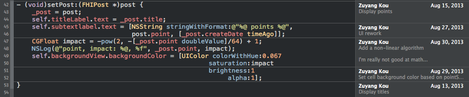

# Live with Git

## What's Git

Git is a free and open source distributed version control system designed to handle everything from small to very large projects with speed and efficiency.

NO.

Git is a distributed file system which is often used as DVCS.

## TL; DR

1. Commit early, commit often
2. Don't change published history

第一条出事了不慌，第二条避免挨骂。

## 3 Sections

1. working directory 就是每天修改的那些文件
2. staging area 是 add 过后还没 commit 的那部分，也叫 index，有些命令用 --cached 表示 staging area
3. repository 已经提交过的代码

## Moving files

- git add, wiring directory -> staging area
- git commit, staging area -> repo
- git checkout, repo -> working directory
- git reset

### git reset

- soft, changes HEAD
- mixed, changes HEAD and index
- hard, changes HEAD, index and working directory

## Revision Selection

- 734713bc047d87bf7eac9674765ae793478c50d3, SHA-1
- HEAD
- HEAD@{0}, reflog
- master@{yesterday}, time
- HEAD^, parent commit
- HEAD^^, parent's parent
- HEAD^2, second parent
- HEAD~, same as HEAD^
- HEAD~2, same as HEAD^^
- master..experiment
- master...experiment

## Rewriting History

- git rebase
- git rebase -i
- git commit --amend
- git revert
- git cherry-pick
- git filter-branch

## I have an upstream project!

### Submodule

- perfect for project you won't touch
- git submodule add
- git submodule init
- git submodule update
- git submodule update --init --recursive
- git submodule foreach git pull

### Subtree

- git subtree add
- git subtree merge
- git subtree pull
- git subtree push
- git subtree split

## Internal

### object

- blob
- commit
- tree
- tag

### reference

- branch
- remote
- HEAD

## Don't Panic when Code is Missing

- Git doesn't lose code you already committed
- Except that `.git` has been deleted :-(
- Use `git reflog` and `git fsck`

### git-reflog

- shows what have been done recently
- alias for `git log -g --abbrev-commit --pretty=oneline`
- customizable

### git-fsck

- find dangling objects
- dangling blob, commit…
- git grep <regex> `git fsck | grep "dangling commit" | cut -d " " -f 3-`

## Don't Panic when Regression is Found

- Use `git bisect`
- Binary search which commit introduces the bug

## Find who is responsible

- `git blame`
- Ask how the code works
- Xcode integration

## PM is Coming!

- git stash

## Configuration

- .gitignore
- .gitattributes
- .gitconfig
- git config

## Alias

### git-alias

- git co
- git config --global alias.co checkout

### shell alias

- alias g=git
- alias gs=git status
- alias gl=git log

## Clean up

- git clean
- git clean -fd

## Working with Gerrit

- git-review
- Change-Ids
- .gitreview

## Reference

Pro git

http://sethrobertson.github.io/GitBestPractices/

RTFM
